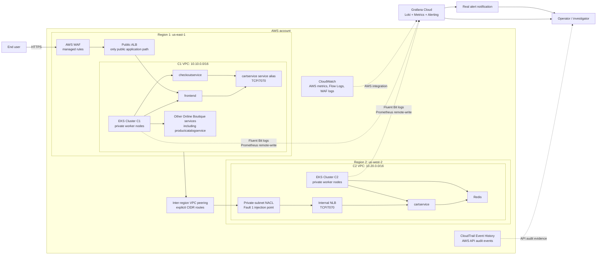

# Architecture

## Purpose

The environment demonstrates a secure, observable application dependency across two
regional Amazon EKS clusters and provides two deterministic incidents for hands-on
triage and root-cause analysis.

The design optimizes for a reliable 12-hour implementation and live interview demo.
It is intentionally smaller than a production landing-zone design, and its omitted
controls will be documented as trade-offs rather than implied to exist.

## Logical architecture



The Excalidraw version should retain the same trust boundaries and numbered traffic
paths. It should show the public/private subnet boundary, but it does not need every
AWS resource produced by Terraform.

## Application placement

Google Online Boutique provides the multi-service application. It is split at the
cart dependency because Redis remains colocated with its client and only defined
application callers traverse the regional boundary.

| Location | Workloads |
|---|---|
| C1 | Frontend, checkout, product catalog, recommendation, payment, shipping, email, currency, ad, load generator, and supporting telemetry components |
| C2 | Cart service and one resource-limited in-cluster Redis pod |

Both `frontend` and `checkoutservice` are intended C1 callers of the C2 cart service.
Other C1 workloads are not authorized to initiate that connection.

Redis uses the upstream in-cluster deployment as a single ephemeral pod. It has a
`ClusterIP` Service only, bounded CPU/memory resources, and `emptyDir` data storage.
Only `cartservice` may connect to Redis on TCP/6379. Redis is never exposed through an
NLB or public endpoint. Loss of carts after a Redis restart is an accepted lab
trade-off and is not presented as a production design.

## Network flows

### 1. User ingress

1. The user connects over HTTPS to the internet-facing C1 ALB.
2. AWS WAF evaluates the request using managed rules.
3. The ALB forwards allowed requests to the C1 frontend workload.

The ALB is the only intended public application endpoint. The browser never connects
directly to a Kubernetes node, Service, pod, or C2 load balancer.

If a validated ACM domain is unavailable during the build window, HTTP plus WAF may
be used temporarily and recorded as a security trade-off. It must not be described as
equivalent to production TLS.

### 2. Cross-region dependency

1. `frontend` or `checkoutservice` resolves the C1 `cartservice` alias.
2. The connection travels through C1 private routing and the inter-region VPC peering
   connection.
3. The request reaches the internal NLB on TCP/7070 in C2.
4. The NLB forwards the request to a healthy `cartservice` pod.
5. `cartservice` accesses Redis locally inside C2.

No internet gateway, public address, or NAT gateway is used in this request path.
The NAT gateways exist only for controlled outbound dependencies such as pulling
container images and sending telemetry.

### 3. Observability egress

Fluent Bit sends selected application and Kubernetes logs outward to Grafana Cloud
Loki. Prometheus sends selected metrics through remote-write to Grafana Cloud Metrics.
The environment accepts no inbound monitoring connection. Grafana Cloud evaluates
alerts and delivers email notifications. The AWS integration provides ALB, NLB, and
WAF signals from CloudWatch. VPC Flow Logs remain available in CloudWatch Logs for
network investigation even if their appearance is delayed.

Loki uses `cluster`, `namespace`, `service`, `container`, and `level` as canonical
indexed labels. `service` groups all replicas of the same workload. Pod name, pod UID,
request ID, image digest, and other high-churn values remain log fields or structured
metadata so they can be inspected without multiplying the number of log streams.

## Security boundaries

### Public boundary

- Only the C1 ALB is internet-facing.
- WAF is associated with the ALB and contains functional rules.
- Public ingress is restricted to the listener ports required by the demo.

### Cluster boundary

- EKS worker nodes run in private subnets without public IP addresses.
- Kubernetes application Services use `ClusterIP`, except the intentional internal
  C2 NLB Service.
- EKS API public access is disabled or restricted to the operator's current CIDR.
- IAM permissions are scoped to the controllers and agents that require them.

### Inter-region boundary

- Peering route tables contain only the peer VPC CIDR routes required for the design.
- The C2 internal NLB accepts TCP/7070 only from the C1 private address space.
- Kubernetes NetworkPolicies allow egress only from the intended C1 callers and
  restrict C2 cart ingress.
- VPC CNI policy enforcement is explicitly enabled and tested with an unauthorized
  pod; the existence of NetworkPolicy objects alone is not accepted as proof.

## Observability model

The minimum dashboard correlates the dependency rather than presenting two isolated
cluster views.

| Layer | Required signals |
|---|---|
| User entry | ALB request count, latency, target errors, WAF allowed/blocked requests |
| C1 symptoms | Frontend/checkout errors and latency, logs, pod health |
| Cross-region path | Active probe success and latency, VPC Flow Log accepts/rejects |
| C2 cause checks | NLB target health, cart pod health, Redis health |
| Kubernetes configuration | Restarts, container termination reason, requested limits, events |

Alerts use a short evaluation window appropriate to the demonstration and deliver a
real notification. Screenshots alone do not prove that a monitor fired.

## Fault model

### Fault 1: stateless network deny

The injector adds a reserved, high-precedence NACL rule to every NACL associated with
the C2 NLB subnets:

```text
DENY TCP/7070 FROM 10.10.0.0/16
```

This breaks existing connections deterministically without changing the workloads.
Expected behavior:

- C1 frontend and checkout operations fail or time out.
- Upstream error/latency and cross-region probe alerts fire.
- C2 cart pods, Redis, and NLB target health remain healthy.
- The current NACL state identifies the immediate network cause.
- VPC Flow Logs later corroborate it with `REJECT` records.
- CloudTrail identifies the configuration actor and timestamp.

Restoration removes only the injected rule and confirms service recovery.

### Fault 2: invalid resource configuration

The injector changes the `productcatalogservice` memory limit to a value below its
startup requirement. The resulting rollout produces OOMKilled containers and
CrashLoopBackOff.

Expected behavior:

- Product catalog availability degrades and the frontend is affected.
- Restart and availability alerts fire.
- Kubernetes events and container status point directly to `OOMKilled` and exit code
  137.
- C1-to-C2 cart networking remains healthy.

This is described as a bad configuration deployment, not as an organic memory leak.
Restoration reinstates the captured previous resource configuration.

## Verification strategy

The verifier combines AWS configuration inspection and active application tests. It
runs in three states:

| State | Expected outcome |
|---|---|
| Healthy baseline | Intended callers succeed; unauthorized and public paths fail |
| Fault 1 active | NACL deny is detected; intended C1-to-C2 request fails |
| Restored | Injected rule is absent; intended connectivity succeeds again |

The public-resource check uses an explicit allowlist: one expected public ALB and one
expected internal NLB. It does not incorrectly require that no Kubernetes
`LoadBalancer` Service exist.

## Availability and cost trade-offs

- Subnets span at least two availability zones, while node counts remain configurable
  to control interview-environment cost.
- One NAT gateway per VPC is a deliberate cost reduction and is not multi-AZ egress.
- VPC peering is selected for speed and clarity; PrivateLink would provide a stronger
  service-consumer boundary in a longer-lived production design.
- The environment remains running until the interview is complete and is destroyed
  afterward to stop EKS, NAT, load-balancer, and WAF charges.

## Deferred production controls

The initial implementation does not claim to include multi-account separation,
Transit Gateway, service mesh mTLS, multi-AZ NAT gateways, automated certificate
rotation, policy-as-code admission control, long-term log archival, disaster
recovery, or a full CI/CD promotion pipeline. These are explicitly outside the
12-hour exercise scope.
