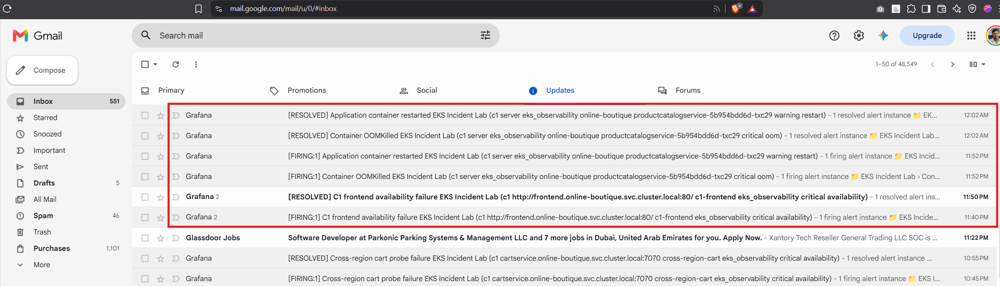

# Phase 11 curated evidence

This directory contains deliberately selected, commit-safe evidence for the Phase 11
`productcatalogservice` configuration-pushed OOM incident. Live Kubernetes, AWS, and
Grafana JSON remains under the ignored `evidence/generated/phase11/` tree.

## Grafana email delivery

The screenshot confirms mailbox delivery for both direct workload alerts:

- `[FIRING:1] Container OOMKilled` and `[RESOLVED] Container OOMKilled`;
- `[FIRING:1] Application container restarted` and
  `[RESOLVED] Application container restarted`.

It also shows the upstream C1 frontend availability FIRING and RESOLVED messages.
The image was supplied by the operator after recovery and has SHA-256:
`1e83a706d1be514f4fd779003ae7d1167bca3dedb0f3c085c8d948ba44377c9a`.

With this mailbox evidence, the Phase 11 incident manifest has no remaining evidence
gap and its exit gate is satisfied.
